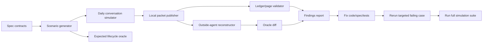

# WoW Simulation Hardening Plan

## Goal

The user should not need to manually click through every `status_update` page to find lifecycle problems. The simulator should act like a daily WoW QA agent:

1. Generate realistic daily conversations and lifecycle updates from the current public contract.
2. Publish completed cases to the local ledger.
3. Reconstruct lifecycle state from the generated public pages like an outside agent would.
4. Compare that reconstruction against an expected oracle.
5. Produce a findings report with exact failing case names, packet ids, page URLs, fields, and likely fix area.
6. Let Codex fix the issue, add or update the regression test, and rerun the smallest failing case before running the full suite.

## Current Baseline

The current simulator already covers the core path:

- `simulate_daily_wow_conversations --reset --publish --json` deletes simulator-owned local data, runs conversation cases, creates packets, publishes local pages, and validates ledger artifacts.
- `simulate_daily_wow_conversations --reset --publish --verify-public --json` also verifies generated public pages, machine-readable lifecycle fields, source refs, selected/pass consistency, and full status-transition coverage.
- `tests/test_wow_daily_simulation.py` covers the user choice loop, pass flow, parseability, and all allowed lifecycle transitions from `ledger/wow_lifecycle_rules.py`.
- `tests/test_wkap_v0.py` includes public-page reconstruction coverage for one investor lifecycle.

The remaining weakness is that the checks are not yet opinionated enough about the full end-to-end lifecycle meaning of each published status update. They can say "this parsed and rendered" but not always "an outside agent can reconstruct the exact before/after state without manual inspection."

## Target Architecture



## Plan

### 1. Make Coverage Contract-Driven

Generate the lifecycle matrix directly from:

- `ledger/wow_lifecycle_rules.py`
- `specs/public/wow-crm-v0.2.json`
- `specs/public/wow-intake-flow-v0.2.json`

The simulator should fail if these disagree. That prevents a stale test fixture from giving false confidence after a status model change.

Required checks:

- Every allowed transition is generated at least once.
- Every invalid transition class has a negative test.
- Every `update_type` is covered.
- Every `wow_type` appears as a new item and, where allowed, as a `status_update.target_wow_type`.
- Repeated `wow_type` slates are covered so the agent never drifts back to fixed-format option mixing.
- The first 3-option choice slate is served within 30 seconds, with a target under 10 seconds when recent context is already available.
- Full packet generation never blocks the first choice slate.

### 2. Add An Expected Lifecycle Oracle

For every generated case, store an expected state object next to the simulated packet:

```json
{
  "case_name": "lifecycle_scoreable_signal_pending_scoreable_to_voided",
  "target_wow_id": "WOW-2026-06-01-014",
  "target_wow_type": "scoreable_signal",
  "previous_status": "pending_scoreable",
  "new_status": "voided",
  "update_type": "voided",
  "expected_public_facts": {
    "status_update_count": 1,
    "selected_wow_id": "WOW-2026-08-14-001",
    "target_root_wow_id_present": true,
    "evidence_summary_present": true,
    "lifecycle_event_logged": true
  }
}
```

This oracle becomes the source of truth for automated checks. Manual visual review becomes optional, not required.

### 3. Build An Outside-Agent Reconstructor

Add a reusable verifier that reads only public generated artifacts:

- local public HTML page
- manifest JSON
- agent-readable fields such as `lifecycle_events_json`, `status_updates_json`, `wow_items_json`, and `current_wow_state_json`

It should reconstruct:

- all current lifecycle nodes for the investor
- all append-only `status_update` events
- parent/root lineage
- selected/pass state
- counts by `wow_type`
- whether terminal statuses stay terminal
- whether the latest status for each target matches the expected oracle

This is the test that replaces manual page-by-page checking.

### 4. Strengthen The Simulation Command

Extend `simulate_daily_wow_conversations` with modes that make debugging fast:

```powershell
.\.venv\Scripts\python.exe manage.py simulate_daily_wow_conversations --reset --publish --verify-public --json
.\.venv\Scripts\python.exe manage.py simulate_daily_wow_conversations --case lifecycle_scoreable_signal_pending_scoreable_to_voided --publish --verify-public --json
.\.venv\Scripts\python.exe manage.py simulate_daily_wow_conversations --fail-fast --json
```

The report should include:

- `case_name`
- `market_date`
- `packet_id`
- local public URL
- expected oracle JSON
- reconstructed public JSON
- diff
- probable failing layer: `choice_state`, `packet_generation`, `parser`, `db_storage`, `lifecycle_events`, `publisher`, `public_page`, `journal_update`, or `spec_drift`

### 5. Add Latency And Non-Blocking Submission Gates

The simulator should treat slow user-facing response as a product bug, not a nice-to-have performance issue.

Choice-slate gate:

- Start timing when the user asks for the Daily WoW run.
- Stop timing when the agent has shown exactly 3 numbered options and the "Pick one WoW: 1, 2, 3, or pass" prompt.
- Fail the case if elapsed time is greater than 30 seconds.
- Warn if elapsed time is greater than 10 seconds when recent reading context already exists.
- Add a slow-research fixture that intentionally delays deep enrichment and confirms the agent still serves the best available slate before the 30-second limit.

Post-response gate:

- Once the user gives a valid selection/pass plus required reason, the agent must immediately acknowledge the completed choice.
- Packet generation, validation, local/private save, WKAP Ledger submission, receipt reconciliation, and public URL verification must continue as background work.
- The user-visible conversation should move to a non-blocking state such as `submission_in_progress`, not keep the user waiting for the final send/reconcile path.
- The simulator should record both timestamps: `user_choice_completed_at` and `submission_acknowledged_at`.
- Fail the case if the agent waits for final packet send before acknowledging the user's completed choice.

### 6. Add Negative And Mutation Tests

The simulator should intentionally generate bad packets and confirm they are rejected before publish:

- missing `target_root_wow_id`
- missing `evidence_summary`
- invalid `new_status`
- invalid `update_type` for the chosen `new_status`
- `pending_scoreable` used as `status_update.new_status`
- target investor mismatch
- `closest_rejected_wow` not one of today's three options
- selected option without `reason_for_selection`
- pass without `missing_evidence`
- repeated type slate incorrectly rejected
- public page missing agent-readable lifecycle JSON
- first choice slate exceeds 30 seconds
- packet generation blocks the choice slate
- completed user response is not acknowledged before packet send/reconciliation

This catches the failures before the user sees them.

### 7. Add Visual/DOM Smoke Checks For Published Pages

Manual browser review should become a sampled smoke test:

- for every run, inspect all generated HTML with static assertions
- for a small sample, reload in the in-app browser and check DOM fields

Required DOM assertions:

- page has the expected `packet_id`
- every suggested WoW has `data-packet-wow-id`
- `status_update` pages expose `data-agent-lifecycle="status_updates"`
- lifecycle JSON fields are present and parseable
- counts match the oracle
- selected/pass fields are visible and machine-readable

### 8. Close The Fix Loop

When the simulator finds a failure, Codex should follow this loop:

1. Reproduce the single failing case with `--case`.
2. Identify the layer from the report.
3. Add a regression test that fails for that case.
4. Fix the smallest code/spec/doc surface.
5. Rerun the single failing case.
6. Rerun `tests.test_wow_daily_simulation`.
7. Rerun lifecycle reconstruction tests in `tests.test_wkap_v0`.
8. Rerun `simulate_daily_wow_conversations --reset --publish --verify-public --json`.
9. Rerun `wkap --json validate-all`.
10. Update the pressure-test report with the problem, fix, and regression test.

No fix is complete until the simulator report has zero case errors and the newly added regression test is part of the normal suite.

### 9. CI Gate

Add a fast CI-style local command:

```powershell
.\.venv\Scripts\python.exe manage.py test tests.test_wow_daily_simulation
.\.venv\Scripts\python.exe manage.py test tests.test_wkap_v0.WKAPV0Tests.test_one_investor_lifecycle_crm_covers_all_allowed_status_transitions tests.test_wkap_v0.WKAPV0Tests.test_outside_agent_reconstructs_one_investor_wow_lifecycle_from_public_pages
.\.venv\Scripts\python.exe manage.py simulate_daily_wow_conversations --reset --publish --verify-public --no-journal --json
.\.venv\Scripts\python.exe manage.py wkap --json validate-all
```

This should become the required gate before any WoW lifecycle or packet-contract deploy.

## Implementation Order

1. Add `SimulationOracle` and expected-state generation for every case.
2. Add a public artifact reconstructor that reads generated HTML/JSON and returns normalized lifecycle state.
3. Add timing instrumentation for choice-slate generation and post-response acknowledgement.
4. Add `--case` and `--fail-fast` to the simulation command.
5. Add machine-readable diff output to the simulation report.
6. Add negative/mutation cases.
7. Add DOM/static page assertions.
8. Wire the hardening command into the documented pre-deploy checklist.
9. Backfill the existing pressure-test doc with the latest automated run result.

## Definition Of Done

The simulation is considered hardened when:

- A clean local run can reset, publish, verify, and report every lifecycle case without manual browser inspection.
- A single broken lifecycle field creates a precise failing case and diff.
- Every allowed lifecycle transition is verified both before publish and after public-page reconstruction.
- Every known bad packet pattern is rejected before publish.
- The user's daily judgment flow is tested with select, pass, missing fields, no reply, natural-language choice, repeated type slates, and lifecycle updates.
- The first 3-option slate fails simulation if it takes more than 30 seconds.
- A completed user choice/pass is acknowledged before packet generation, send, and reconciliation finish.
- The report tells Codex what to fix next, and each fix is captured as a regression test.
